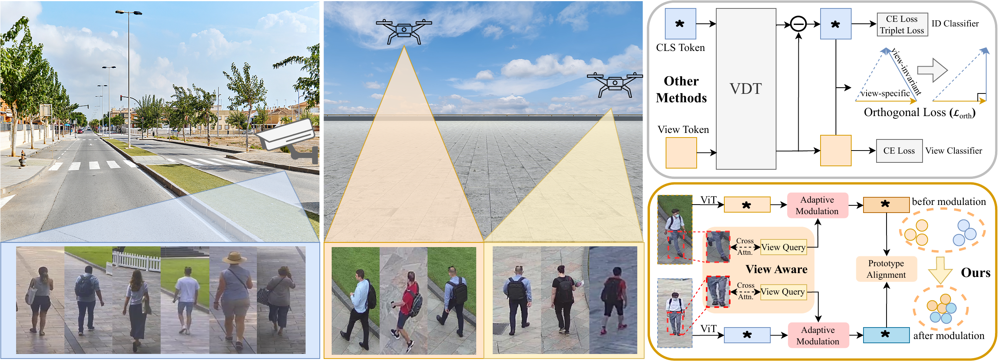
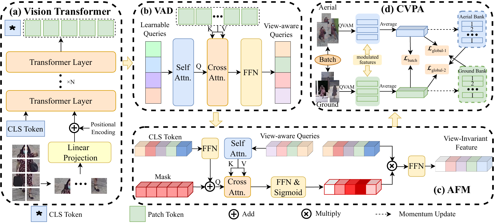
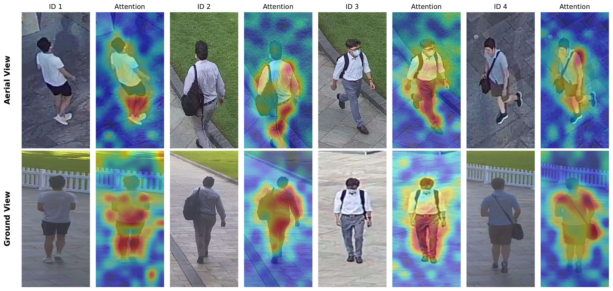
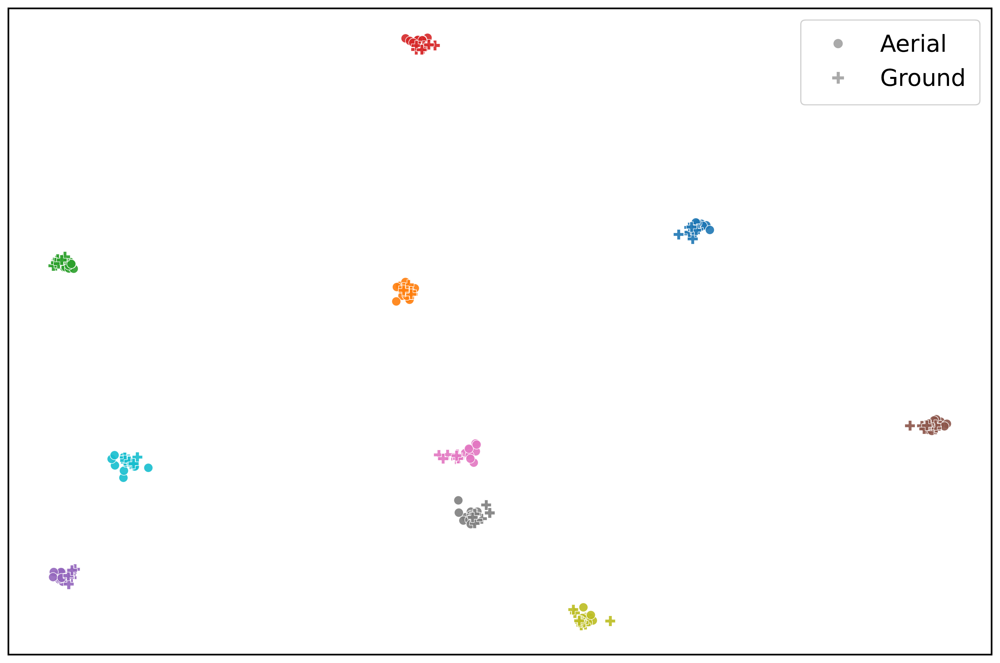

# QVAM: Query-guided View-aware Adaptive Modulation for Aerial-Ground Person Re-Identification

This repository is the official implementation of the paper **"QVAM: Query-guided View-aware Adaptive Modulation for Aerial-Ground Person Re-Identification"** (ECCV 2026 Submission, Paper ID #1275).

[](https://arxiv.org/) <!-- Replace with actual link when available -->
[](https://github.com/) 

---

## 1. Introduction

Aerial-Ground Person Re-Identification (AGPReID) matches pedestrian identities across aerial (UAV) and ground cameras. However, it suffers from severe viewpoint gaps. Existing approaches often rely on coarse binary view labels (aerial vs. ground) and rigid orthogonal constraints, which oversimplify continuous viewpoint variations (such as altitude and depression-angle shifts) and might suppress identity-discriminative details.

To mitigate these issues, we propose **Query-guided View-aware Adaptive Modulation (QVAM)**:
* **View-aware Decoder (VAD):** Employs learnable view queries to extract fine-grained, continuous viewpoint cues from local patch tokens, bypassing the limitations of binary domain supervision.
* **Adaptive Feature Modulation (AFM):** Generates query-conditioned channel-wise modulation masks to adapt the global `[CLS]` token, suppressing viewpoint-biased responses while preserving identity-discriminative details.
* **Cross-View Prototype Alignment (CVPA) Loss:** Aligns modulated features across aerial and ground views at both the batch level and global level using dual-view memory banks.

<p align="center">
  
  <br>
  <em>Figure 1: Comparison between previous rigid disentanglement methods and our proposed adaptive modulation strategy (QVAM).</em>
</p>

---

## 2. Method Overview

<p align="center">
  
  <br>
  <em>Figure 2: The pipeline of the proposed QVAM framework. It consists of (a) Vision Transformer backbone, (b) View-aware Decoder (VAD), (c) Adaptive Feature Modulation (AFM) module, and (d) Cross-View Prototype Alignment (CVPA).</em>
</p>

---

## 3. Main Empirical Results

Our method achieves competitive performance across three representative AGPReID benchmarks: **CARGO**, **AG-ReID**, and **AG-ReIDv2**.

### Performance on CARGO
| Method | Protocol 1 (ALL) Rank-1 / mAP | Protocol 2 ($A \leftrightarrow G$) Rank-1 / mAP | Protocol 3 ($A \leftrightarrow A$) Rank-1 / mAP | Protocol 4 ($G \leftrightarrow G$) Rank-1 / mAP |
| :--- | :---: | :---: | :---: | :---: |
| ViT | 61.54 / 53.54 | 43.13 / 40.11 | 80.00 / 64.47 | 82.14 / 71.34 |
| VDT | 64.10 / 55.20 | 48.12 / 42.76 | 82.50 / 66.83 | 82.14 / 71.59 |
| SeCap | 68.59 / 60.19 | 69.43 / 58.94 | 80.00 / 68.08 | 86.61 / 75.42 |
| **QVAM (Ours)** | **78.85 / 71.02** | **72.50 / 64.41** | **85.00 / 79.63** | **91.07 / 82.62** |

### Performance on AG-ReID & AG-ReIDv2
* **AG-ReID:** Reaches **85.53%** Rank-1 / **76.81%** mAP on $A \rightarrow G$, and **88.46%** Rank-1 / **80.52%** mAP on $G \rightarrow A$.
* **AG-ReIDv2:** Consistently improves retrieval quality across all protocols, e.g., achieving **82.29%** mAP on $A \rightarrow C$ and **85.15%** mAP on $A \rightarrow W$.

---

## 4. Requirements & Preparation

Our implementation is based on the [fast-reid](https://github.com/JDAI-CV/fast-reid) codebase.

### Step 1: Environment Setup
Please refer to [INSTALL.md](./INSTALL.md) to install the required dependencies (such as PyTorch, torchvision, etc.).

### Step 2: Dataset Preparation
1. Download the datasets (**CARGO**, **AG-ReID**, or **AG-ReIDv2**).
2. Configure your local dataset paths in the corresponding dataset loader files. For example, for the CARGO dataset, modify:
   ```python
   # In fastreid/data/datasets/cargo.py
   self.data_dir = "YOUR_DATASET_PATH/CARGO"
   ```

### Step 3: Prepare Pre-trained Models
Download the ImageNet-pretrained ViT-B/16 backbone and update the path in your configuration files:
```yaml
# In configs/CARGO/qvam.yml (or configs/AG-ReID/qvam.yml)
MODEL:
  BACKBONE:
    PRETRAIN_PATH: "YOUR_PRETRAIN_PATH/vit_base_patch16_226.pth"
```

---

## 5. Training & Evaluation

### Training
To train QVAM on CARGO with a single GPU:
```bash
CUDA_VISIBLE_DEVICES=0 python3 tools/train_net.py --config-file ./configs/CARGO/QVAM.yml
```

To train with multiple GPUs:
```bash
CUDA_VISIBLE_DEVICES=0,1 python3 tools/train_net.py --config-file ./configs/CARGO/QVAM.yml --num-gpus 2
```

### Evaluation
To evaluate a trained model checkpoint:
```bash
CUDA_VISIBLE_DEVICES=0 python3 tools/train_net.py --config-file ./configs/CARGO/qvam.yml --eval-only MODEL.WEIGHTS "path/to/your_checkpoint.pth"
```

---

## 6. Qualitative Visualizations

### Query-to-Patch Attention
As shown below, despite the absence of explicit spatial supervision, our learnable queries adaptively focus on salient human body parts across both aerial and ground views.

<p align="center">
  
  <br>
  <em>Figure 3: Visualization of VAD query-to-patch attention maps for different identities.</em>
</p>

### Feature Distribution (t-SNE)
t-SNE visualizations illustrate that QVAM successfully aligns features from different views of the same identity into compact clusters, mitigating the extreme cross-view domain gap.

<p align="center">
  
  <br>
  <em>Figure 4: t-SNE distribution comparing the ViT baseline and our QVAM.</em>
</p>

---

## 7. Citation

If you find this work or codebase helpful in your research, please consider citing:

```bibtex
@InProceedings{QVAM_ECCV2026,
    author    = {Anonymous},
    title     = {QVAM: Query-guided View-aware Adaptive Modulation for Aerial-Ground Person Re-Identification},
    booktitle = {Submission to European Conference on Computer Vision (ECCV)},
    year      = {2026}
}
```

## Acknowledgement
This repository is built upon [fast-reid](https://github.com/JDAI-CV/fast-reid). We thank the authors for their excellent codebase.